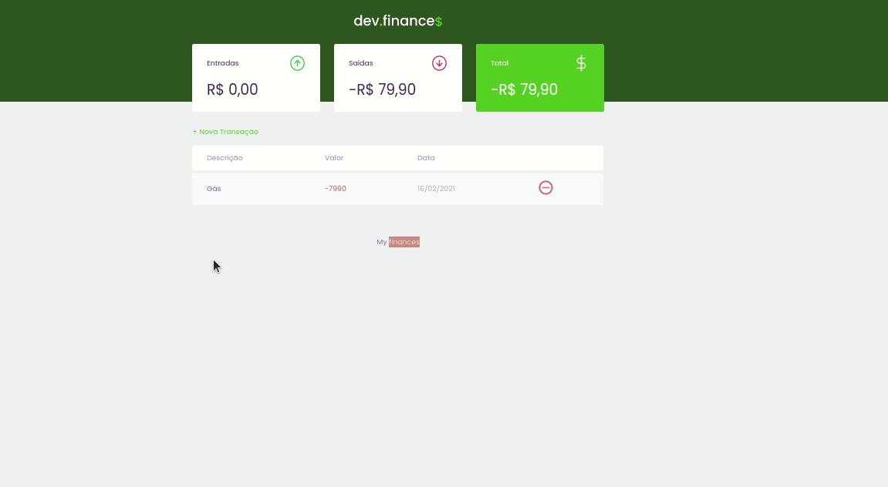

<h1>
  
</h1>

# Índice

- [Sobre](#-sobre)
- [Tecnologias Utilizadas](#-tecnologias-utilizadas)
- [Como baixar o projeto](#-como-baixar-o-projeto)

## 📝Sobre

O projeto **DevFinance** é um gerenciador de finanças desenvolvido pela Rockseat na semana **discover** com intuito de práticar a base do desenvolvimento Web.
Foi explorada toda a semântica html para melhora o **SEO** do google.

---

## 🚀Tecnologias utilizadas

O projeto foi desenvolvido utilizando as seguintes tecnologias

- HTML
- CSS
- Javascript

---

## 📦Como baixar o projeto

```bash
# Clonar o repositório
$ git clone https://github.com/JL-Sousa/My_Finances.git

# Entrar no diretório
$ cd my_finances

# Iniciar o projeto
abra o arquivo index.html no browser
```

---

🔥Desenvolvido por ****_Jonyelson Lopes_****
